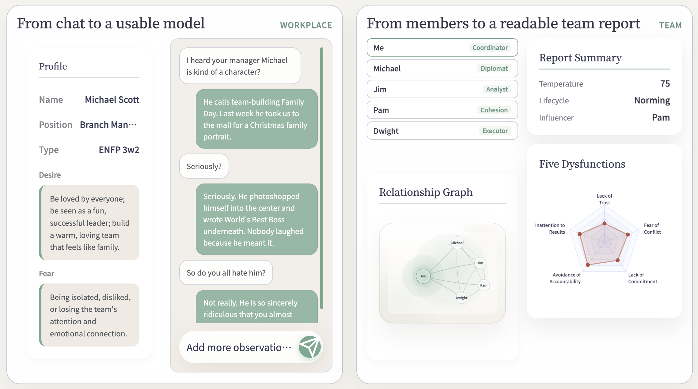
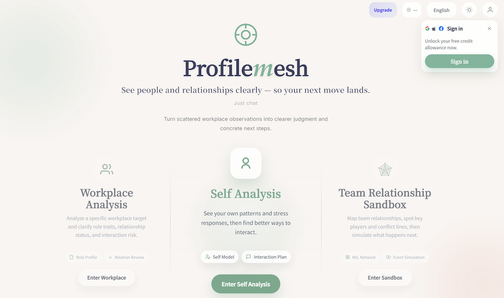

## [Profilemesh](https://app.profilemesh.com/)

*Helps you decode office politics and delivers actionable counter-strategies.* 

Profilemesh helps you decode office politics, spot hidden alliances, understand your position inside the team, read your boss more accurately, and navigate coworkers with more precision. Instead of reacting to people problems after the damage is done, you see the dynamics earlier and move with more clarity.

---

#### Brief example

[Model yourself](https://app.profilemesh.com/app/self)

[Model your colleagues](https://app.profilemesh.com/app/workplace)

[Build your workplace team](https://app.profilemesh.com/app/team-sandbox)

#### [Main page](https://app.profilemesh.com/)

Log in to receive free points.

#### Introduction

Most people are not losing at work because they lack skill. They are losing because they cannot see the real human game clearly.

Who actually influences decisions? Where are the hidden alliances? What is your boss really optimizing for? How should you approach a cautious coworker, a political manager, or a high-pressure team without stepping into the wrong dynamic?

That is why we built Profilemesh.

Profilemesh helps you:

1. analyze workplace relationships and power dynamics
2. understand your own patterns and social positioning
3. read your boss, coworkers, and team signals more clearly
4. simulate team tension, conflict paths, and likely next moves
5. turn scattered observations into structured insight and action
   It is built for people who need more than productivity tools. If you want to navigate workplace politics, team dynamics, and human complexity with more clarity, this is what we are building for.

Would love to hear:
What is the hardest people problem you are dealing with at work right now?
